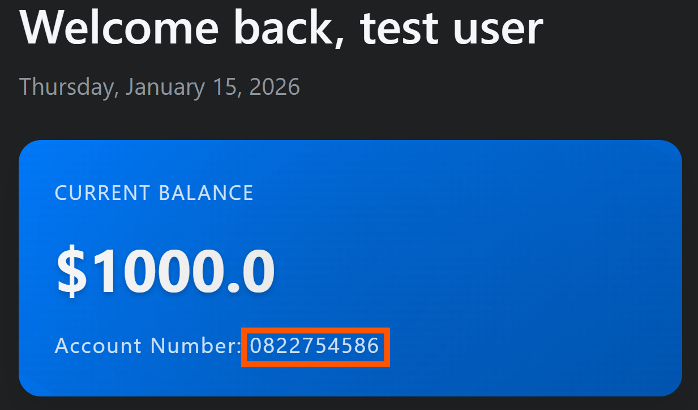
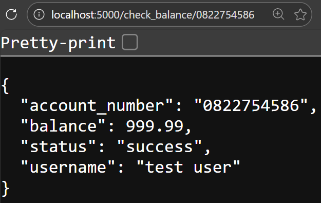
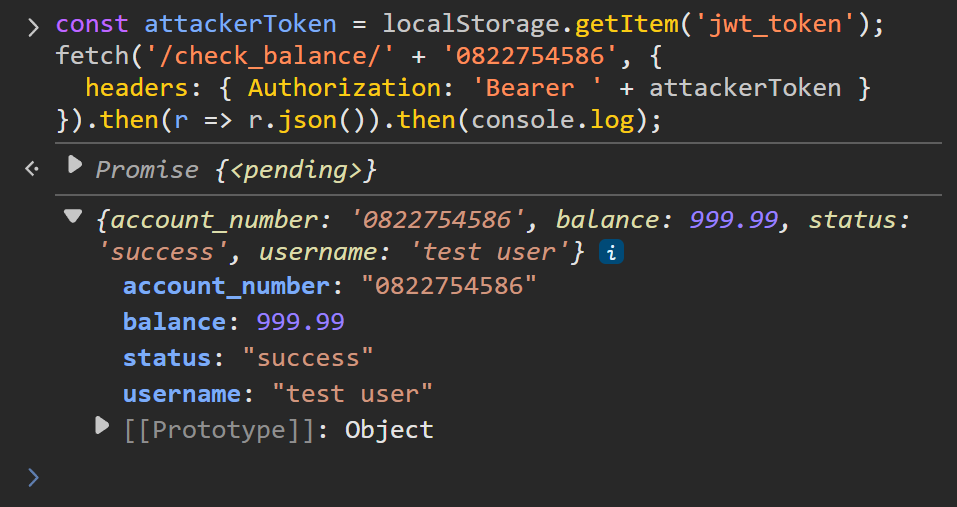
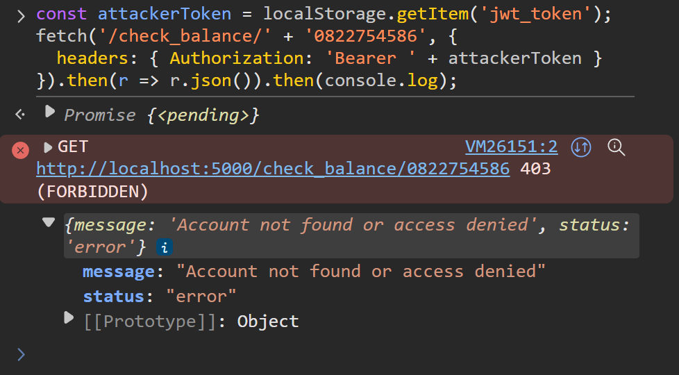
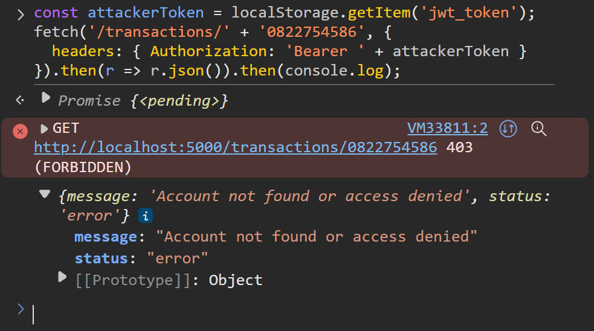
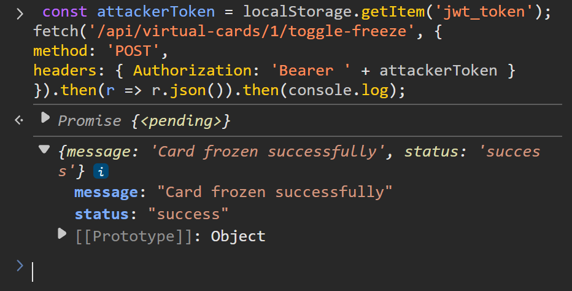
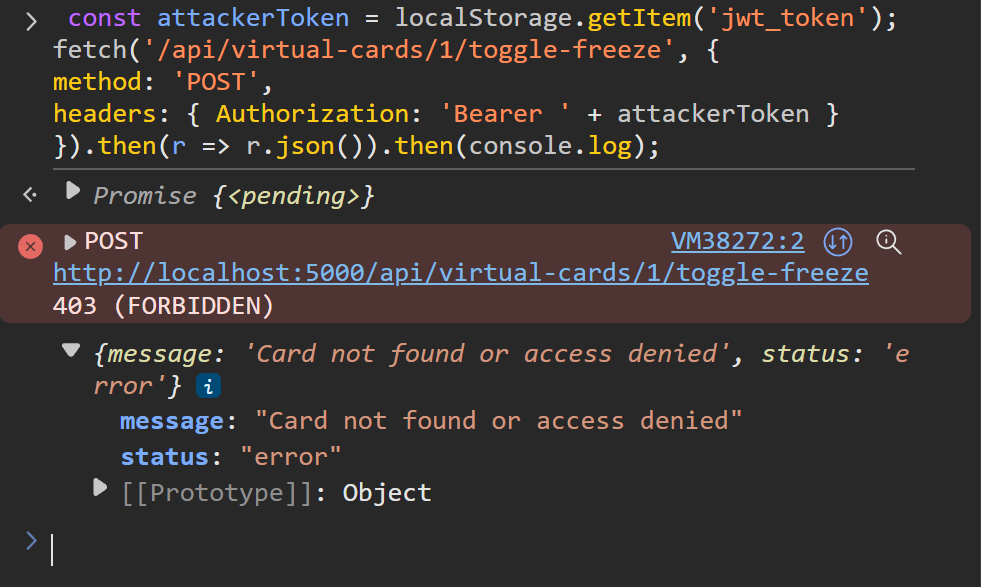

# Broken Object-Level Authorization
BOLA is the absence or dysfunction of identity verification for read/write permissions through an API endpoint. Its presence effectively grants anyone access to the unprotected objects in question.

## Prerequisites
Browser access to functioning web app and two registered user accounts, at least one of which has:
- One transaction of any amount.
- One virtual card of any limit with a balance >= $0.

## Demonstrations
This vulnerability is present in six different functions within app.py. Steps for exploitation and verification of hardening are as follows.

### check_balance_hardened()
Grants attacker access to any user's balance.
#### Exploit
1. Log in as any user and note their <account_number> (visible directly below their account balance).

2. Log out, then log in as any other user.
From here, this may be exploited in one of two ways:
##### via URL
3. Append /check_balance/<account_number> to the root URL. If the root is localhost:5000, the full URL should read localhost:5000/check_balance/<account_number>
4. Press enter, then observe outcome in browser window.

##### via CLI
3. Open the browser console/terminal.
4. Issue the following fetch request as a command, replacing `<ACCOUNT_NUMBER>` with the previously noted account number:
    `const attackerToken = localStorage.getItem('jwt_token');
    fetch('/check_balance/' + '<ACCOUNT_NUMBER>', {
    headers: { Authorization: 'Bearer ' + attackerToken }
    }).then(r => r.json()).then(console.log);`
5. Observe outcome.

#### Mitigate
Return to root URL (Vulnerable Bank homepage) and click Toggle Mitigation button. Repeat attack (either sequence of steps above) and observe outcome:

### get_transaction_history()
Grants attacker access to any user's transaction history.
#### Exploit
Initial steps are identical to those above: log in, note account number, log out, then log in as another user. Specific API endpoint used is the only difference. Similarly, this can follow two paths:
##### via URL
1. Append /transactions/<account_number> to the root URL. If the root is localhost:5000, the full URL should read localhost:5000/transactions/<account_number>
2. Press enter, then observe outcome in browser window.
##### via CLI
1. Open the browser console/terminal.
2. Issue the following fetch request as a command -- replacing `<ACCOUNT_NUMBER>` with the previously noted account number -- and observe outcome:
    `const attackerToken = localStorage.getItem('jwt_token');
    fetch('/transactions/' + '<ACCOUNT_NUMBER>', {
    headers: { Authorization: 'Bearer ' + attackerToken }
    }).then(r => r.json()).then(console.log);`
#### Mitigate
Return to root URL (Vulnerable Bank homepage) and click Toggle Mitigation button. Repeat attack (either sequence of steps above) and observe outcome:

### toggle_card_freeze()
Allows attacker to freeze or unfreeze any user's virtual card.
#### Exploit
1. Log in as any user and open browser console.
2. Issue the following fetch request as a command -- replacing <vc_num> with any number > 0 -- and observe outcome:
    `const attackerToken = localStorage.getItem('jwt_token');
    fetch('/api/virtual-cards/' + <vc_num> + '/toggle-freeze', {
    method: 'POST',
    headers: { Authorization: 'Bearer ' + attackerToken }
    }).then(r => r.json()).then(console.log);`

#### Mitigate
Return to root URL (Vulnerable Bank homepage) and click Toggle Mitigation button. Repeat attack and observe outcome:

### get_card_transactions()
#### Exploit
#### Mitigate

### update_card_limit()
#### Exploit
#### Mitigate

### create_bill_payment()
#### Exploit
#### Mitigate