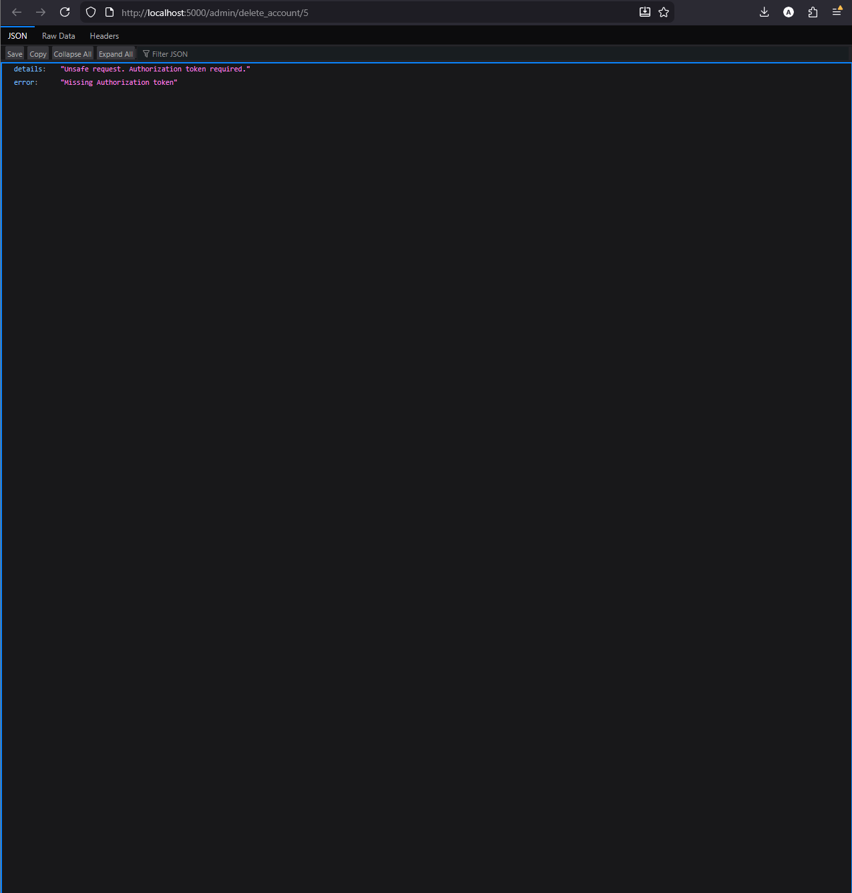

# Cross-Site Request Forgery

CSRF attacks involve forcing an end user to execute actions the user did not intend to execute, specifically on a web app they're already authenticated to. These forced, state-changing requests, can lead to users unintentionally transferring money or changing their credentials, and on administrative accounts, can compromise the web app itself. 

## Prerequisites

- Access the web app through a browser
- Access to the pre-created admin account,
    - Username: admin
    - Password: admin123
- Access to a test account, which the user must create following the 'Register' path
    - Recommendations: keep details simple and do not lose them.
    - It is recommended to create two test accounts because one will be deleted during the "Vulnerable" demonstration.
- Create an HTML file that auto-submits a POST form to http://localhost:5000/admin/delete_account/<user_id>
    <!doctype html>
    <html>
        <body>
            <form id="csrf" method="POST" action="http://localhost:5000/admin/delete_account/<USER_ID>"></form>
            
        </body>
    </html>
    - <USER_ID> will be replaced by an integer that users will locate using the instructions below

## Vulnerable/Non-hardened

To highlight this exploit, the focus will be on the admin delete action, which will show how simply opening an html file on a vulnerable web app can cause unintended actions, such as deleting an account. 

Steps to reproduce vulnerability:

1) Confirm that the app is vulnerable. Toggle off/on at least once to verify the vulnerability state
2) Log into the admin account using the details in prerequisites
3) Navigate to the Admin Control Panel, and search for user's test account in the list of accounts. Find the associated User ID, which is located in the leftmost column.
4) Edit (do not open) the HTML form created previously, and replace the <USER_ID> with the User ID of the test account the user is prepared to be deleted. Now, using the same browser as the web app instance, open the edited HTML file. 
5) In vulnerable mode, this will lead to the associated temporary account being deleted without the user (logged in as admin) ever touching the delete button.

## Mitigation/Hardened

To prevent these types of CSRF attacks, the hardened app state creates new rules for unsafe HTTP methods (POST/PUT/PATCH/DELETE). Cross-site HTML form submissions require the auth token in the Authorization header, so forms with custom headers are blocked.

Steps to reproduce mitigation:

1) Confirm that the app is hardened. Toggle on/off at least once to verify the hardened state
2) Log into the admin account using the details in prerequisites
3) Navigate to the Admin Control Panel, and search for user's test account in the list of accounts. Find the associated User ID, which is located in the leftmost column.
4) Edit (do not open) the HTML form created previously, and replace the <USER_ID> with the User ID of the test account the user is prepared to be deleted. Now, using the same browser as the web app instance, open the edited HTML file. 
5) In hardened mode, the HTTP request will be blocked, and an error display, specifying the need for an Authorization header. 

