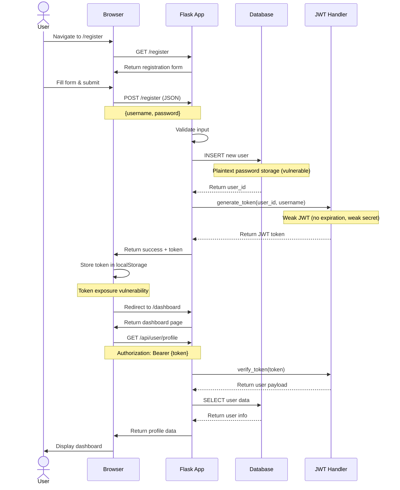
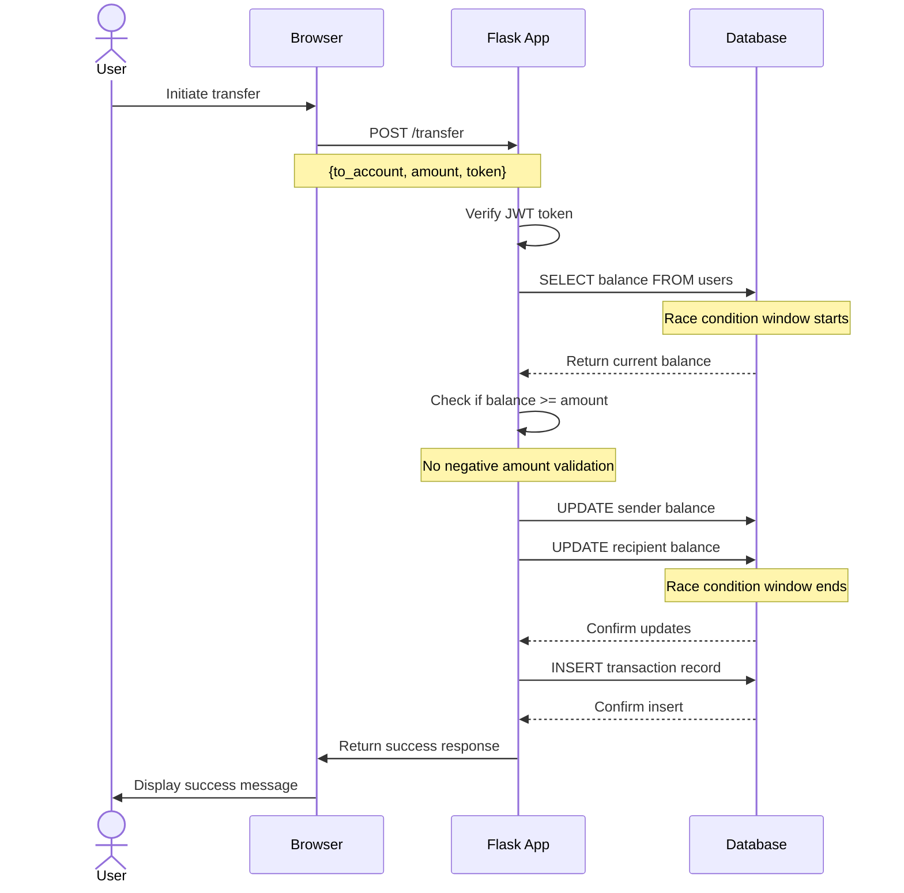

# Vulnerable Bank - Documentation

## Quick Start Guide

### Starting the Application

The application should already be running. If not:

**Using Docker Compose:**
```bash
docker-compose up --build
```

**Local Setup:**
```bash
python3 -m venv venv
source venv/bin/activate
pip install -r requirements.txt
python3 app.py
```

### Accessing the Application

1. Open your web browser
2. Navigate to [URL TBD]
3. You should see the Vulnerable Bank landing page

---

## Application Architecture

### User Registration & Authentication Flow




### Money Transfer Flow



---

## Creating an Account Walkthrough

### Step 1: Access Registration Page

1. On the landing page, click the **"Register"** button (bottom right)
2. You'll be taken to `/register` where a registration form appears

### Step 2: Fill Registration Form

The form has two fields:
- **Username**: Enter your desired username
- **Password**: Enter your password

**Security Vulnerabilities Demonstrated:**
- ⚠️ No password complexity requirements
- ⚠️ No CSRF protection
- ⚠️ Passwords stored in plaintext
- ⚠️ No input sanitization (XSS vulnerable)

### Step 3: Submit Registration

1. Click the **"Register"** button on the form
2. Behind the scenes:
   - Server validates basic input (username exists, fields not empty)
   - Creates new user record in database with plaintext password
   - Generates account number automatically
   - Assigns initial balance of $1000.00
   - Creates JWT token with weak security (no expiration, weak secret)

### Step 4: Automatic Login & Dashboard

1. Upon successful registration:
   - JWT token is stored in browser's `localStorage` (security vulnerability)
   - You're automatically redirected to `/dashboard`
   - Dashboard displays your account information

### Step 5: Dashboard Features

Your dashboard shows:
- **Account Number**: Your unique account identifier
- **Current Balance**: Starting at $1000.00
- **Username**: Your registered username
- Navigation menu to:
  - Transfer Money
  - Request Loan
  - View Transactions
  - Manage Virtual Cards
  - Pay Bills
  - AI Customer Support

---

## Exploring Vulnerabilities

### Testing Account Creation

**Try these test scenarios to discover vulnerabilities:**

#### 1. SQL Injection (in Login)
- **Username**: `admin' --`
- **Password**: `anything`
- **What happens**: Bypasses password check and logs in as admin

#### 2. XSS Injection (Username field)
- **Username**: `<script>alert('XSS')</script>`
- **Password**: `test123`
- **What happens**: Script executes in the browser (check browser console)

#### 3. Normal User Creation
- **Username**: `testuser`
- **Password**: `password123`

### Default Admin Account

Pre-configured admin account available:
- **Username**: `admin`
- **Password**: `admin123`
- **Account Number**: `ADMIN001`

Use this to explore admin-specific vulnerabilities.

### Race Condition Testing (Transfer Feature)

After creating an account with initial $1000:

1. Go to **Transfer Money** page
2. Open browser developer tools (F12)
3. Open the **Network** tab
4. Initiate multiple transfers in rapid succession
5. Watch the race condition as transfers process simultaneously

**Expected vulnerability**: Balance may become inconsistent or allow overdrafts due to concurrent request handling.

### JWT Token Manipulation

1. After logging in, open browser DevTools (F12)
2. Go to **Application** → **Local Storage** → `http://localhost:5000`
3. Find the `token` entry
4. The token can be:
   - Decoded (it has no expiration)
   - Potentially modified with weak secret
   - Used indefinitely (no expiration time)

⚠️ **This application is intentionally vulnerable for educational purposes**

The registration process demonstrates multiple security flaws including:
- No rate limiting on registration attempts
- Plaintext password storage
- Weak JWT implementation
- Missing CSRF protection
- XSS vulnerabilities
- SQL injection vulnerabilities
- No email verification
- No CAPTCHA protection

**Never use this code in production environments!**
