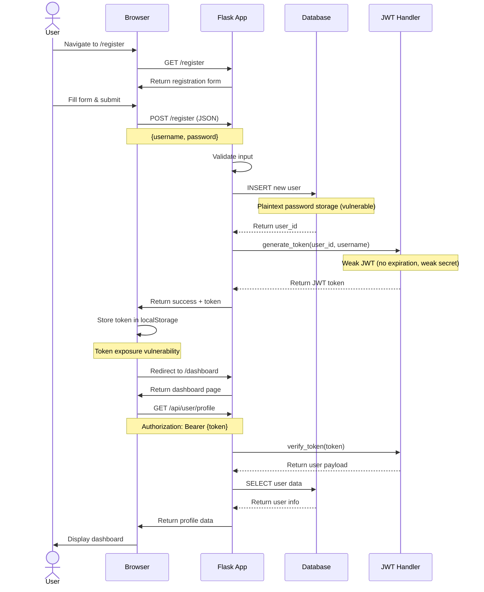
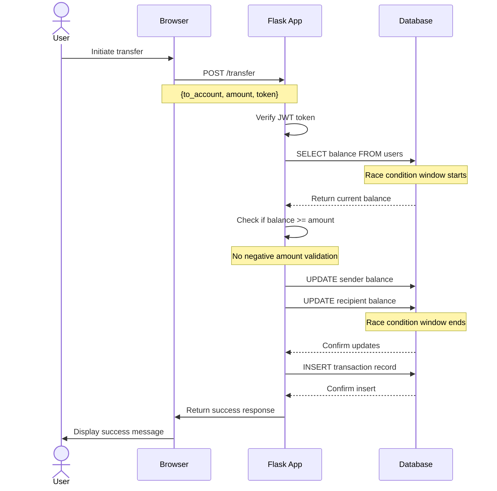

# Vulnerable Bank - Documentation

## Quick Setup Guide

### Using Docker Compose (Recommended)

1. Clone the repository:
```bash
git clone https://github.com/Commando-X/vuln-bank.git
cd vuln-bank
```

2. Start the application:
```bash
docker-compose up --build
```

3. Access the application at `http://localhost:5000`

### Local Installation

1. **Prerequisites**: Python 3.9+, PostgreSQL

2. **Clone and setup**:
```bash
git clone https://github.com/Commando-X/vuln-bank.git
cd vuln-bank
python3 -m venv venv
source venv/bin/activate  # On Windows: venv\Scripts\activate
pip install -r requirements.txt
```

3. **Configure database**:
   - Edit `.env` file and change `DB_HOST=localhost`

4. **Create uploads directory**:
```bash
mkdir -p static/uploads
```

5. **Run the application**:
```bash
python3 app.py
```

### Access Points
- Main Application: `http://localhost:5000`
- API Documentation: `http://localhost:5000/api/docs`

---

## Application Architecture

### User Registration & Authentication Flow



### Money Transfer Flow



---

## Creating an Account Walkthrough

### Step 1: Access Registration Page

1. Open your web browser
2. Navigate to `http://localhost:5000`
3. Click the **"Register"** button on the landing page


### Step 2: Fill Registration Form

1. You'll see a registration form with two fields:
   - **Username**: Enter your desired username
   - **Password**: Enter your password

2. **Note**: The application has the following vulnerabilities:
   - ⚠️ No password complexity requirements
   - ⚠️ No CSRF protection
   - ⚠️ Passwords stored in plaintext
   - ⚠️ No input sanitization (XSS vulnerable)

### Step 3: Submit Registration

1. Click the **"Register"** button
2. The form data is sent via POST request to `/register` endpoint
3. Behind the scenes:
   - Server validates basic input (username exists, fields not empty)
   - Creates new user record in database with plaintext password
   - Generates account number automatically
   - Assigns initial balance of $1000.00
   - Creates JWT token with weak security (no expiration, weak secret)

### Step 4: Automatic Login

1. Upon successful registration:
   - JWT token is stored in browser's `localStorage` (security vulnerability)
   - You're automatically redirected to `/dashboard`
   - Dashboard loads your profile information

### Step 5: Access Dashboard

1. Dashboard displays:
   - **Account Number**: Your unique account identifier
   - **Current Balance**: Starting at $1000.00
   - **Username**: Your registered username
   - Navigation to features:
     - Transfer Money
     - Request Loan
     - View Transactions
     - Manage Virtual Cards
     - Pay Bills
     - AI Customer Support

### Testing Account Creation

**Try these test scenarios:**

1. **Normal User**:
   - Username: `testuser`
   - Password: `password123`

2. **SQL Injection Test** (demonstrates vulnerability):
   - Username: `admin' --`
   - Password: `anything`

3. **XSS Test** (demonstrates vulnerability):
   - Username: `<script>alert('XSS')</script>`
   - Password: `test`

### Default Admin Account

The application comes with a pre-configured admin account:
- **Username**: `admin`
- **Password**: `admin123`
- **Account Number**: `ADMIN001`
- **Admin Privileges**: Yes

---

## Security Notes

⚠️ **This application is intentionally vulnerable for educational purposes**

The registration process demonstrates multiple security flaws including:
- No rate limiting on registration attempts
- Plaintext password storage
- Weak JWT implementation
- Missing CSRF protection
- XSS vulnerabilities
- SQL injection vulnerabilities
- No email verification
- No CAPTCHA protection

**Never use this code in production environments!**
