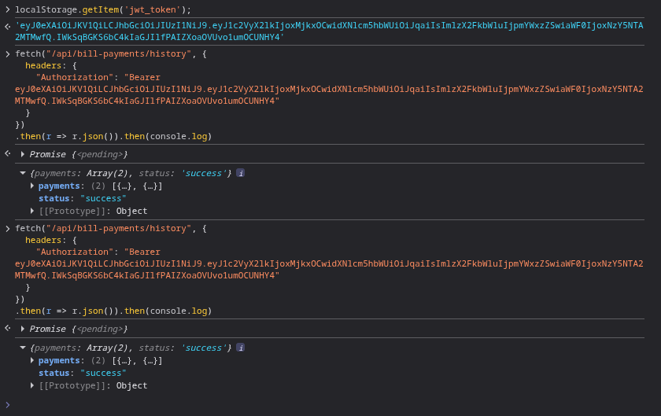
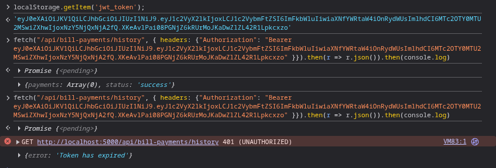

# No Session/Token Expiration
No session/token expiration means that the JWT token remains valid indefinitely. This is a large security risk if an attacker
acquires a token as it will never expire and can continue to be used.
## Prerequisites
Browser access to functioning web app and least one registered user account.
## Demonstrations
This vulnerability is present within auth.py.Steps for exploitation and verification of hardening are as follows.
#### Exploit
1. Login as any registered user.
From here, this may be exploited with the CLI.
##### via CLI
2. Open the browser console/terminal.
3. Paste in the following command: `localStorage.getItem('jwt_token');`
This will list the token
4. Issue the following fetch request as a command replacing `YOUR_TOKEN_HERE` with the token listed above:
: `fetch("/api/bill-payments/history", {
headers: {"Authorization": "Bearer YOUR_TOKEN_HERE"
}}).then(r => r.json()).then(console.log)`

5. Wait 15 seconds and paste in the same command with the same token number.
6. See result:

    

#### Mitigate
Return to root URL (Vulnerable Bank homepage) and click Toggle Mitigation button.
7. Repeat the directions above.
8. See result:

    

